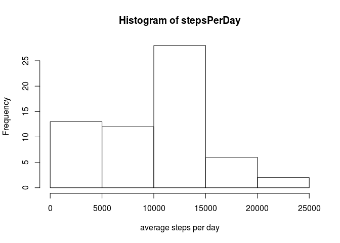

# Reproducible Research: Peer Assessment 1


## Loading and preprocessing the data

```r
data <- read.csv("activity.csv", header = TRUE)
str(data)
```

```
## 'data.frame':	17568 obs. of  3 variables:
##  $ steps   : int  NA NA NA NA NA NA NA NA NA NA ...
##  $ date    : Factor w/ 61 levels "2012-10-01","2012-10-02",..: 1 1 1 1 1 1 1 1 1 1 ...
##  $ interval: int  0 5 10 15 20 25 30 35 40 45 ...
```


## What is mean total number of steps taken per day?

Calculate the sum of steps for each day:

```r
stepsPerDay <- tapply(data$steps, data$date, sum, na.rm =TRUE)
```

Plot a histogram of this data:


```r
hist(stepsPerDay)
```

 

###Mean
To calculate the mean of the data, we simply run:

```r
meanSteps <- mean(stepsPerDay)
```
and see that the mean is 9354.2295082.  

###Median
The median is calculated simillarly by running:

```r
medianSteps <- median(stepsPerDay)
```

Which shows that the median is 10395.

## What is the average daily activity pattern?
First, we create an array of the averages of each 5-minute interval
over all the obersvations.
We then plot this data to get an overview.


```r
intervalAvgs <- tapply(data$steps, data$interval, mean, na.rm = TRUE)
plot(names(intervalAvgs), intervalAvgs, type="l")
```

 

We can see from the plot that the maximum value is somewhere between 0700 and 1000.
To get the exact result, we can run


```r
which.max(intervalAvgs)
```

```
## 835 
## 104
```
and see that the interval "835", which is the 104th element in the *internalAvgs* array,
contains the maximum number of steps.
To get the actual number, we simply acces this element

```r
intervalAvgs[104]
```

```
##      835 
## 206.1698
```
and see that the maximum average number of steps is 206.1698


## Imputing missing values
To count the number of missing values, we create a logical vector that is TRUE for NA values.
We then sum it up, utilizing the fact that TRUE is represented as 1.

```r
missing <- sum(is.na(data$steps))
```
We can see that there are 2304 missing values, which is about 13.11% of the datapoints.

To impute *NA* values, we iterate over the rows of the data frame.
When we encounter an *NA* value in the "steps" column, we look up this value
from the *intervalAvgs* vector, using the name of the required interval.

```r
#Create a copy of the original data
correctedData <- data.frame(data)
for (i in 1:nrow(correctedData)) {
  if(is.na(correctedData[i, "steps"])) {
    #Get a String that represents the current interval
    interval <- as.character( correctedData[i, "interval"] )
    #lookup the average of that interval and replace the NA value 
    correctedData[i, "steps"] <- intervalAvgs[ interval ]
  }
}
```

We calculate the daily sums of the corrected data and apply the mean and meadian functions to
the result, just like before:

```r
correctedStepsPerDay <- tapply(correctedData$steps, correctedData$date, sum, na.rm = TRUE)
correctedMeanSteps <- mean(correctedStepsPerDay)
correctedMedianSteps <- median(correctedStepsPerDay) 
```

The histogram of the corrected data looks like this:

```r
hist(correctedStepsPerDay)
```

 

Let's have a look at the original and corrected histograms side-by-side.

```r
par(mfrow=c(1, 2))
hist(stepsPerDay)
hist(correctedStepsPerDay)
```

 

```r
par(mfrow=c(1, 1))
```

We can see that the new histogram is more balanced and that the frequency for the lowest bin
is now smaller. To compare the mean and median, we can combine the old and new data into a little comparison dataframe:

```r
comparison <- data.frame(c(meanSteps, correctedMeanSteps), c(medianSteps, correctedMedianSteps))
names(comparison) <- c("mean", "median")
row.names(comparison) <- c("old", "new")
comparison
```

```
##         mean   median
## old  9354.23 10395.00
## new 10766.19 10766.19
```

Here we can see that both the mean and the median have increased for the corrected data.

## Are there differences in activity patterns between weekdays and weekends?
To answer this question, we need to decide for every observation,
if it was on a weekday or on the weekend and add this information to the dataframe.


```r
#Convertg the *date* column to the Date type
correctedData$date <- as.Date(correctedData$date)
#Create a vector of the days from the dates
days <- weekdays(correctedData$date)
#Create a character vector representing the type of day
daytype <- ifelse(days %in% c("Saturday", "Sunday"), "weekend", "weekday")
#Convert it to a factor and 'attach' it to the data
correctedData <- cbind(correctedData, daytype)
```

With the *daytype* column added to the corrected data,
we can calculate the interval averages seperated by weekday and weekend.
We do this by using the *aggregate* function.
Aggregate works similar to *tapply*, but returns a dataframe instead.
We just need to adjust the column names afterwards.


```r
byDaytypeData <- with(correctedData, aggregate(steps, list(interval, daytype), mean) )
names(byDaytypeData) <- c("interval", "daytype", "steps")
library(lattice)
xyplot(steps ~ interval | daytype, data=byDaytypeData, type="l", layout=c(1,2))
```

 


