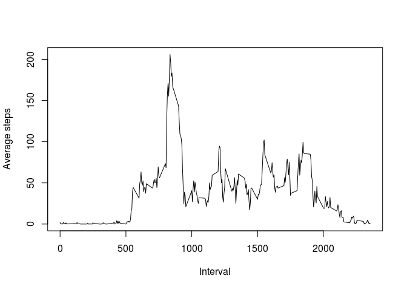

# Reproducible Research: Peer Assessment 1


## Loading and preprocessing the data

```r
data <- read.csv("activity.csv", header = TRUE)
str(data)
```

```
## 'data.frame':	17568 obs. of  3 variables:
##  $ steps   : int  NA NA NA NA NA NA NA NA NA NA ...
##  $ date    : Factor w/ 61 levels "2012-10-01","2012-10-02",..: 1 1 1 1 1 1 1 1 1 1 ...
##  $ interval: int  0 5 10 15 20 25 30 35 40 45 ...
```


## What is mean total number of steps taken per day?

Calculate the sum of steps for each day:

```r
stepsPerDay <- tapply(data$steps, data$date, sum, na.rm =TRUE)
```

Plot a histogram of this data:


```r
hist(stepsPerDay)
```

 

###Mean
To calculate the mean of the data, we simply run:

```r
meanSteps <- mean(stepsPerDay)
```
and see that the mean is 9354.2295082.  

###Median
The median is calculated simillarly by running:

```r
medianSteps <- median(stepsPerDay)
```

Which shows that the median is 10395.

## What is the average daily activity pattern?
First, we create an array of the averages of each 5-minute interval
over all the obersvations.
We then plot this data to get an overview.


```r
intervalAvgs <- tapply(data$steps, data$interval, mean, na.rm = TRUE)
plot(names(intervalAvgs), intervalAvgs, type="l")
```

 

We can see from the plot that the maximum value is somewhere between 0700 and 1000.
To get the exact result, we can run


```r
which.max(intervalAvgs)
```

```
## 835 
## 104
```
and see that the interval "835", which is the 104th element in the *internalAvgs* array,
contains the maximum number of steps.
To get the actual number, we simply acces this element:

```r
intervalAvgs[104]
```

```
##      835 
## 206.1698
```

## Imputing missing values


## Are there differences in activity patterns between weekdays and weekends?
